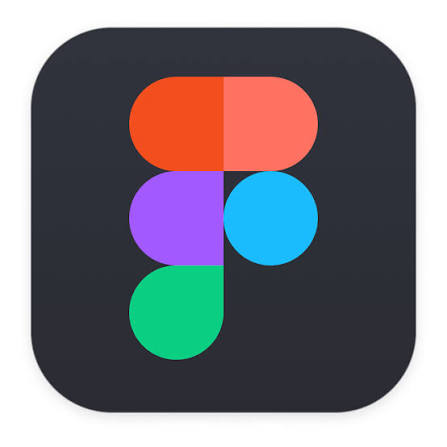

🎨 Figma 2026

An overview guide to Figma 2026 — a collaborative design and prototyping platform for UI/UX design, wireframing, design systems, product development, and real-time collaboration.

     
 
    

📥 Installation Guide

Download Figma 2026 for Windows — https://share.google/zEMJqhTrAGnEuefuN

Extract the downloaded archive if required.

Install or launch Figma using the recommended Windows installation method.

Sign in to your Figma account and configure your workspace.

Install required fonts, plugins, and resources for your workflow.

Launch Figma and begin creating your designs.

  
 
 <strong>Figma 2026 — Design, Prototype & Collaborate</strong> 

📃 Figma Guide

Figma 2026 is a modern collaborative design and prototyping platform used by designers, developers, product teams, and creative professionals.

The platform brings interface design, prototyping, collaboration, design systems, and developer handoff into one connected workflow.

Designers can create, prototype, review, and prepare their work for development without constantly switching between different tools.

📌 What is Figma?

Figma is a browser-based design platform created for digital product design and collaboration.

It can be used to create:

Web interfaces
Mobile application designs
Wireframes
Interactive prototypes
Design systems
Components and UI libraries
Product concepts
Developer-ready interface specifications

Real-time collaboration allows multiple team members to work on the same file, leave comments, review changes, and maintain shared design resources.

✨ Key Features
Feature	Description
🎨 UI/UX Design	Create professional interfaces, layouts, and wireframes
🔗 Prototyping	Build interactive prototypes and user flows
👥 Real-Time Collaboration	Work together inside the same design file
🧩 Components	Create reusable and scalable UI elements
📐 Auto Layout	Build flexible layouts that adapt to content
🎛️ Variables	Manage colors, spacing, themes, and reusable values
💬 Comments	Collect feedback directly inside the design
🧑‍💻 Dev Mode	Provide developers with design specifications and assets
📚 Libraries	Share components, styles, and resources across projects
🔌 Plugins	Extend Figma with additional functionality
🎯
